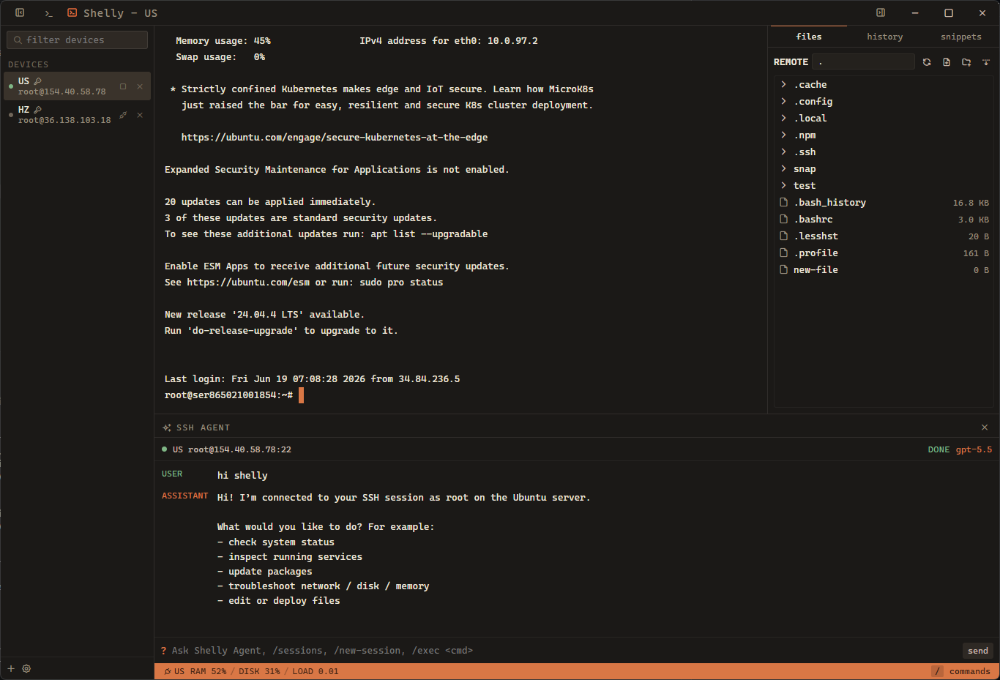
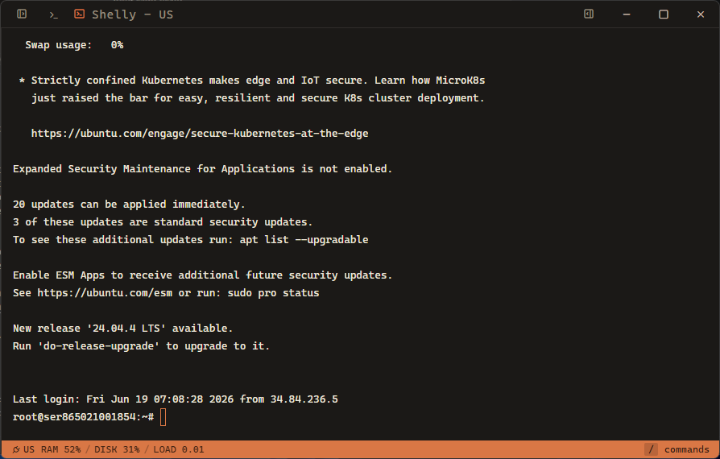
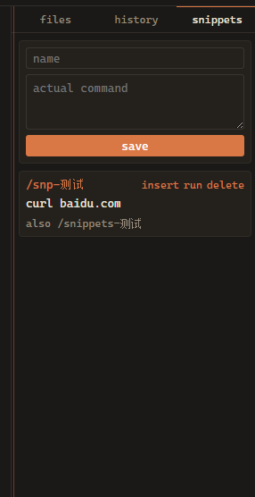
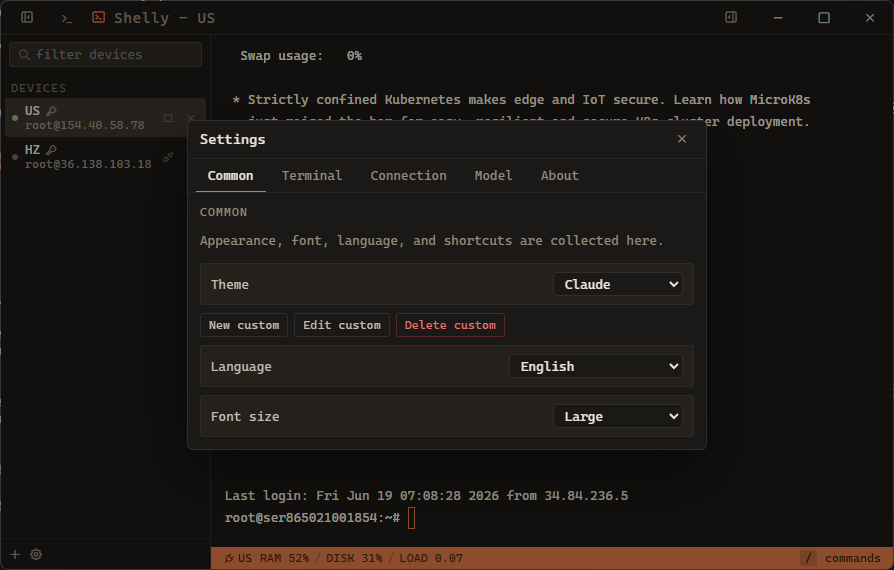
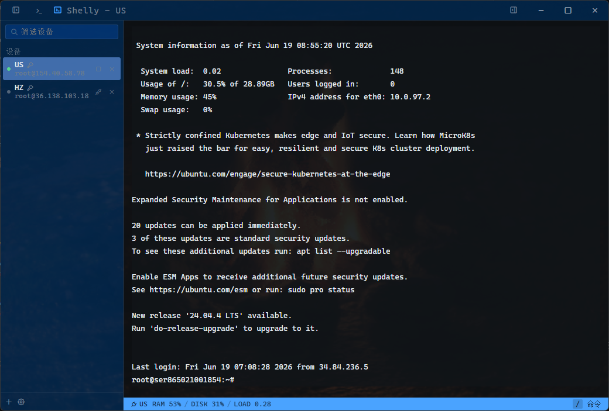
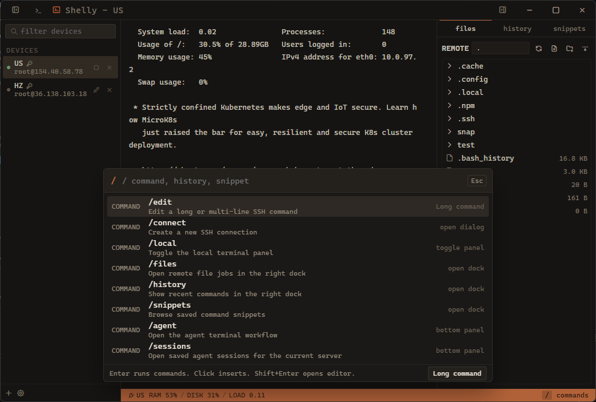
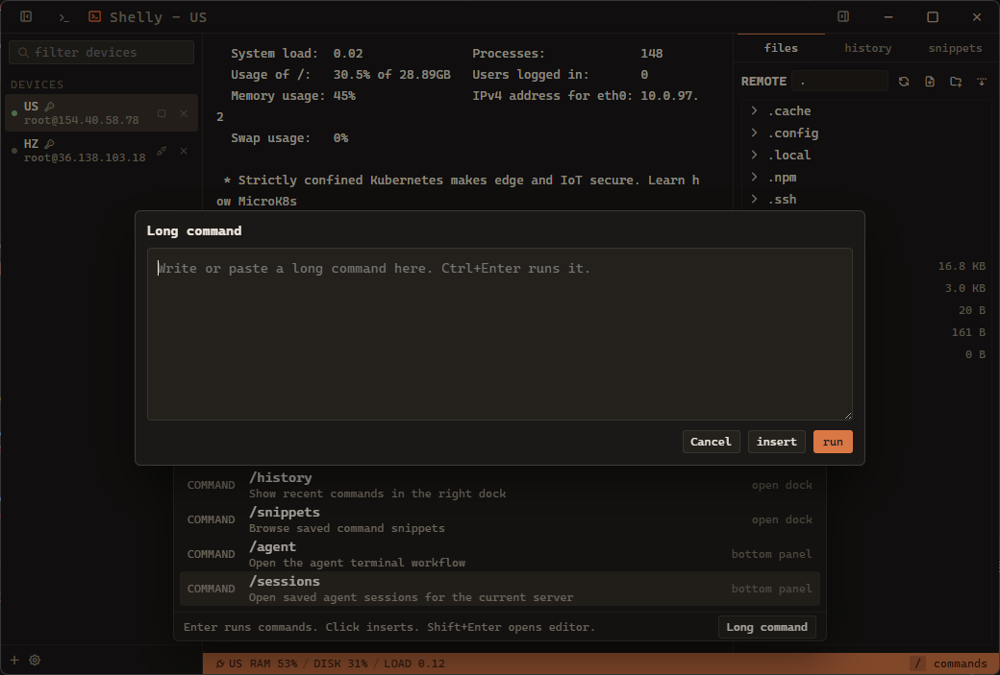
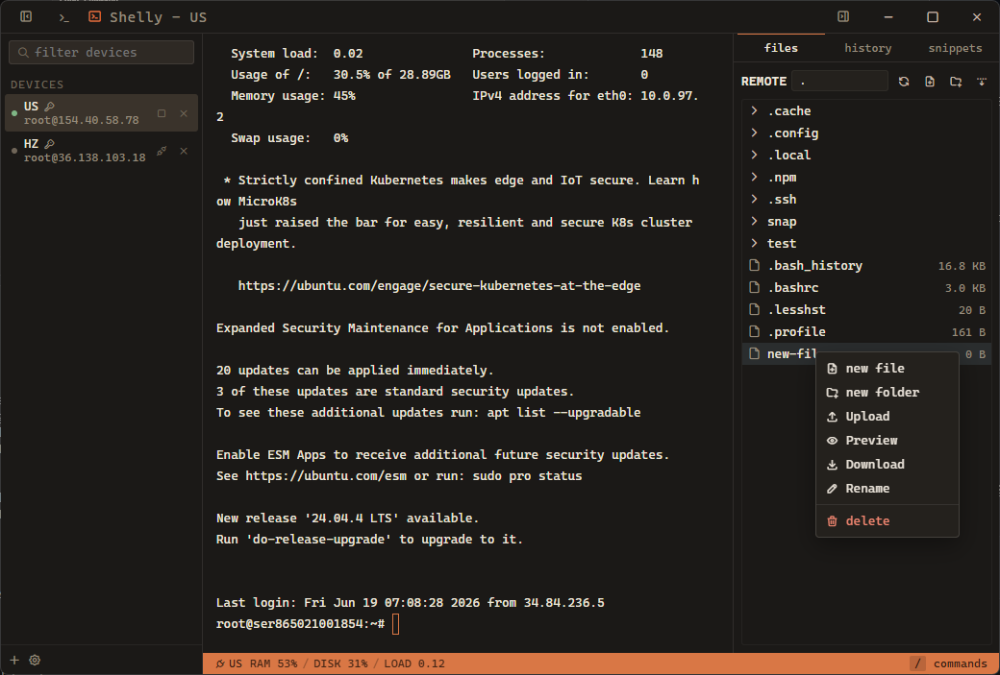
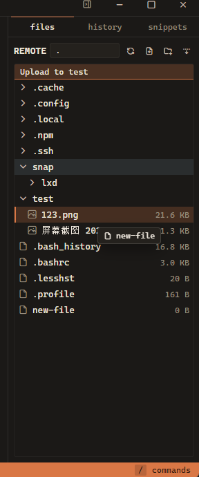

<p align="center">
  
</p>

<h1 align="center">Shelly SSH</h1>

<p align="center">
  A polished desktop SSH workspace for terminal sessions, remote files, command workflows, and supervised AI assistance.
</p>

## Screenshots

<table>
  <tr>
    <td></td>
    <td></td>
    <td></td>
  </tr>
  <tr>
    <td></td>
    <td></td>
    <td></td>
  </tr>
  <tr>
    <td></td>
    <td></td>
    <td></td>
  </tr>
</table>

## What It Is

Shelly is a Tauri 2 desktop SSH client built with React, TypeScript, Rust, xterm.js, russh, russh-sftp, SQLite, and the Windows credential store through `keyring`.

The app is designed around a compact operations workspace:

- A persistent device sidebar for saved SSH targets.
- A high-performance xterm.js SSH terminal with live theme and terminal setting updates.
- A right-side SFTP workspace for browsing, previewing, uploading, downloading, renaming, creating, and deleting remote files.
- A bottom panel that can switch between a local PowerShell terminal and Shelly Agent.
- A command palette, command history, snippets, custom themes, and update management.

## Design

### Desktop Shell

Shelly uses Tauri as the desktop container and keeps the UI in React. The frontend state is centralized in `zustand`, while durable application data is stored through Rust commands backed by SQLite. Secrets such as saved SSH passwords and AI provider keys are written through the platform credential API when available, with a local encrypted-cache fallback path handled by the backend.

The interface is intentionally dense and utility-first. Devices stay on the left, contextual work stays on the right, and terminals remain the center of the workflow. Most panels can be opened, resized, or hidden without tearing down active sessions.

### SSH Sessions

SSH is implemented in Rust with `russh`. The frontend talks to the backend through Tauri commands and event streams:

- SSH output is streamed into xterm.js.
- Terminal resize and input are sent back to the active SSH session.
- Host key verification uses `known_hosts` handling with configurable unknown-host and changed-key behavior.
- Keepalive, connection timeout, default auth, post-connect behavior, and automatic reconnect are configurable.
- Recent SSH terminal output is saved locally per device and can be restored visually on the next connection.

### Remote Files

The file dock uses `russh-sftp` and a job queue model. File operations emit progress updates back to the UI, so long-running transfers and recursive operations stay visible and cancellable where supported.

Supported remote file workflows include:

- Directory browsing with cached expanded state per device.
- File preview.
- Upload and download with conflict policy choices.
- Recursive folder upload/download.
- Create file, create folder, rename, and delete.
- Drag-oriented remote interactions.
- Destructive actions require confirmation.

### Agent Workflow

Shelly Agent is a supervised SSH assistant, not an autonomous shell runner. It keeps conversation state in SQLite and binds conversations to SSH session snapshots where available.

The agent workflow is built around explicit user control:

- Providers are configurable in Settings.
- OpenAI Responses and Claude Messages provider shapes are supported.
- Commands proposed by the model require approval.
- Interactive commands are handed off to the main SSH terminal, with the user completing prompts manually.
- Agent sessions are persisted and can be managed or deleted from the Model settings page.

### Customization

Shelly includes built-in themes and user-defined custom themes. Custom themes can control UI colors, terminal colors, background image, and terminal background opacity. Terminal behavior is also configurable:

- Font family, font size, and line height.
- Cursor style and blink.
- Scrollback.
- Terminal padding.
- Bell behavior.
- Copy on selection.
- Right-click paste.
- Right-click word selection.

### Updates

The About page includes GitHub release update checks. Shelly compares the current version against the latest GitHub release tag, selects a matching Windows installer asset, downloads it with progress, opens the installer, and exits only after the installer process is confirmed started. Automatic update checks are available but disabled by default.

## Main Features

- Multi-session SSH device management.
- Password and private-key authentication.
- Host key verification and known-host management.
- Configurable keepalive, timeout, reconnect, and post-connect behavior.
- xterm.js remote terminal and local PowerShell panel.
- Session content restore prompt for recent SSH output.
- VS Code-style SFTP file dock with transfer jobs.
- Command palette, command history, and snippets.
- Shelly Agent with approval-gated command execution.
- Agent session persistence and deletion.
- Built-in themes, custom themes, and terminal settings.
- About page with GitHub release update flow.
- English and Simplified Chinese UI text.

## Tech Stack

- Desktop: Tauri 2
- Frontend: React 18, TypeScript, Vite
- State: Zustand
- Terminal: xterm.js
- Backend: Rust, Tokio
- SSH/SFTP: russh, russh-keys, russh-sftp
- Local terminal: portable-pty
- Storage: rusqlite with bundled SQLite
- Credentials: keyring
- Updates: GitHub Releases through reqwest

## Development

Prerequisites:

- Node.js 22+
- Rust stable
- Windows WebView2 runtime

Install dependencies:

```powershell
npm ci
```

Run the frontend Vite dev server:

```powershell
npm run dev
```

Run the Tauri app for integration testing:

```powershell
npm run dev:tauri
npx tauri dev
```

Build and check:

```powershell
npm run build
cd src-tauri
cargo check
```

## Release

Windows release packaging is handled by GitHub Actions when a version tag is pushed:

```powershell
git tag v0.3.0
git push origin v0.3.0
```

The workflow creates a draft GitHub Release with Windows artifacts. Shelly's built-in updater reads the latest release from GitHub, compares tags semantically, downloads the matching installer, launches it, and exits the app after the installer process starts.

## License

MIT
